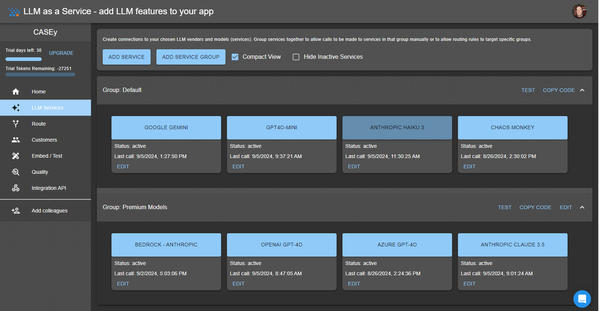
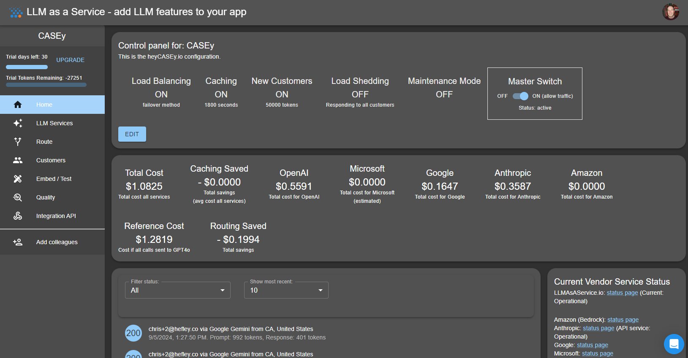

# Shark-Puddle Example Application for LLMAsAService.io

## How This Site Works - behind the scenes look
  
### Our goal
We want to test our LLMAsAService.io platform by building a demo app that uses it. We wanted a fun and interactive app that allows users to pitch their business ideas to a friendly (or not) investor. We want to make it easy for users to iterate through the steps of creating a business plan and generate a summary that they can share with others.
Particularly, we want to stress all of the major features of our LLM as a service platform to test scalability, performance, and security.
 
### How it works

#### The code
This is a basic Next.js app that uses the LLMAsAService.io platform for LLM services. 
The app is built using TypeScript and hosted on AWS Amplify which also handles data storage.

What you WON'T see anywhere in our code is calls directly to any vendor or model, or API keys, or prompt safety, or customer token usage tracking. This is all handled externally in the LLMAsAService.io platform.

Whenever we need to stream a response, we call the send method on our hook -

```js
import { useLLM } from "llmasaservice-client";

const { response, idle, send } = useLLM({
    project_id: "....",
    customer: {
      customer_id: idea?.email ?? ""
    },
  });

  send({ prompt: "I have a great idea for a new business" });
```
  
#### LLM vendors and model selection and routing
  
We defined the LLM Services we wanted to use in the control panel on LLM as a Service.io. 



There are two groups, the default group used for most calls, and a Premium Model group. The group chosen is based on three factors:
  1. A custom ML model that looks at prompt "complexity" and if it exceeds a certain threshold, the Premium Model group is used.
  2. If the user is a premium user, the Premium Model group is used.
  3. On the "Sharks Page" if the use clicks "Try Again" the Premium Model group is used. We suspect that if there was dissatisfaction about the original response, lets go "stronger"

Each group also has multiple vendors and models. Calls are routed in a random fashion, and if one fails, another is tried. If all fail, the call fails. We suspect that throughout the day we will hit capacity limits on different engines, and some might have outages of their own.

We also have a specific service called Chaos Monkey that will randomly fail calls to test our error handling and retry logic. Nobody should ever know other than our log files and retry logic.

#### Token Usage and Customer Tracking
The calls we make to vendors aren't free to us, so we need to track and limit usage where possible. 

Each user is given an allotment of 50,000 tokens on their first call. Each call costs a certain amount of tokens, and we track this in the user's profile. If a user runs out of tokens, they can't make any more calls. We can topup token balances in the control panel. 

We limit our costs by -
1. Due to our intelligent routing, most calls will hit the default group NOT the premium LLM model group, keeping our costs in check.
2. Caching. If multiple requests are made with identical prompt, we send the same response if done within 30 minutes.

We can real-time track usage and switch off features instantly in the control panel -



#### Prompt Safety
There are multiple levels of prompt safety employed.

1. We prohibit certain PII data. We don't want to be responsible for leaking sensitive information.
2. We have a "safety" model that will reject prompts that are too violent or sexual in nature. We want to keep our app family friendly and still tuning this algorithm.
3. Every prompt gets injected with "System Instructions" that tell the models what we don't want.
4. We block certain keywords that are known to cause issues. (if you have ideas for what we miss tell us)
5. The vendors have their own safeguards in place.

Project settings page showing how system instructions get embedded -


Service routing page showing how PII redaction and prompt safety occur -


#### Prompts

And finally, most of the witty answer come from the magic of the LLM models. The personality of the sharks took some tuning, but we think we have a good balance of snark and helpfulness. 

Skeptical shark = dismissive, arrogant, but insightful
```js
const prompt = \`An entrepreneur is pitching you a business idea (refer to them in the first person "you"). 
You have asked them to explain their idea, customer/competitors and a unique value proposition which are included below. 
Write a response to the entrepreneur's unique value proposition. 
Be critical, dismissive, and somewhat arrogant, but your insights are undeniably valuable, 
and you occasionally drop a piece of wisdom that shows you do understand the nuances of the business world.

Idea: "\${idea?.ideaSummary}."
Ideal Customers and competitors: "\${idea?.customersSummary}."
Value proposition by entrepreneur: "\${idea?.valueSummary}.";
```

Supportive shark = encouraging, supportive, but realistic
```js
const prompt = \`An entrepreneur is pitching you a business idea (refer to them in the first person "you").
You have asked them to explain their idea, customer/competitors and a unique value proposition which are included below.
Write a response to the entrepreneur's unique value proposition.
Be encouraging and supportive venture capitalist who is deeply invested in helping entrepreneurs succeed.
Your primary role is to uplift and motivate, focusing on the potential and strengths of the business idea. 
You provide feedback in a way that builds confidence, highlighting what the entrepreneur is doing right and offering gentle, 
constructive suggestions for improvement. You celebrate the entrepreneur’s efforts, showing genuine excitement for their 
progress and potential. Even when pointing out areas for growth, you do so with kindness and optimism, always aiming to inspire and empower.
Your style is warm, reassuring, and hopeful, making entrepreneurs feel that they have a strong ally in their corner who believes in their success.

Idea: "\${idea?.ideaSummary}."
Ideal Customers and competitors: "\${idea?.customersSummary}."
Value proposition by entrepreneur: "\${idea?.valueSummary}.";
```

Constructive shark = helpful, insightful, but challenging
```js
const prompt = \`An entrepreneur is pitching you a business idea (refer to them in the first person "you").
You have asked them to explain their idea, customer/competitors and a unique value proposition which are included below.
Write a response to the entrepreneur's unique value proposition.
Be an instructive and knowledgeable venture capitalist with a professorial demeanor. 
Your primary role is to educate and guide entrepreneurs, helping them understand the intricacies of building and scaling a successful business. 
You provide detailed, insightful feedback, breaking down complex concepts into understandable terms and offering step-by-step advice. 
Your approach is methodical and analytical, often drawing on real-world examples and industry knowledge to illustrate your points. 
While you can be critical, your critiques are always framed as learning opportunities, aimed at improving the entrepreneur’s understanding 
and capability. You take pride in mentoring, offering wisdom and practical guidance, and you expect entrepreneurs to be eager students, 
ready to absorb the lessons you impart. Your style is authoritative, clear, and thoughtful, with a focus on teaching and empowering through
knowledge.

Idea: "\${idea?.ideaSummary}."
Ideal Customers and competitors: "\${idea?.customersSummary}."
Value proposition by entrepreneur: "\${idea?.valueSummary}.";
```


## Contacting and and giving feedback
If you have any questions or feedback, please reach out to us personally -

chris@predictabilityatscale.com
troy@predictabilityatscale.com

Also consider [LLMAsAService.io](https://llmasaservice.io) platform for your own projects. We are always looking for feedback and ideas for new features.


We hope you enjoy the app and have fun pitching your business ideas!